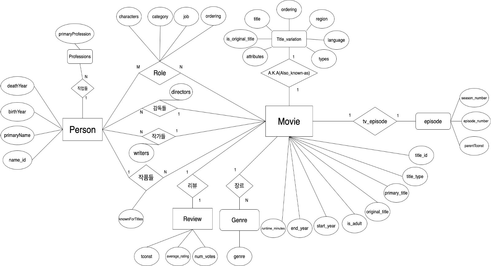
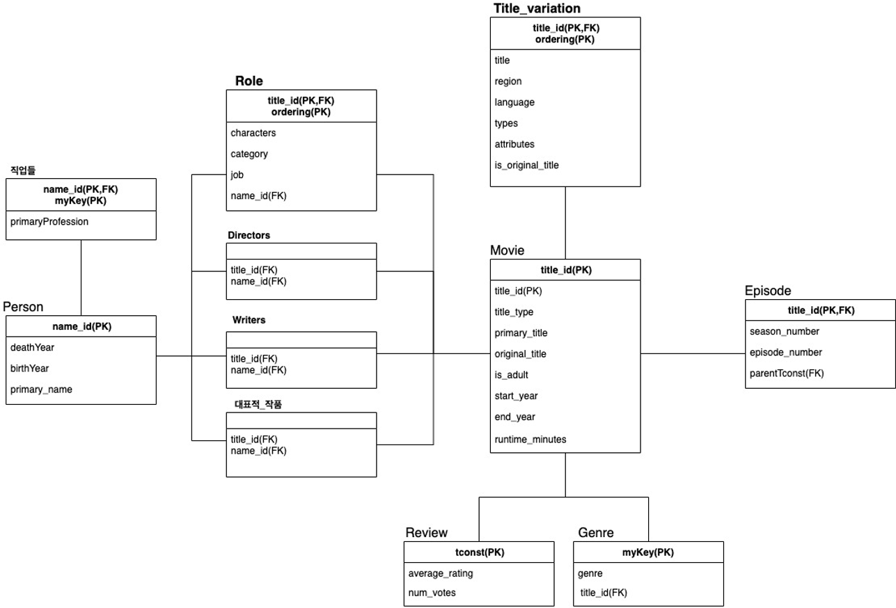
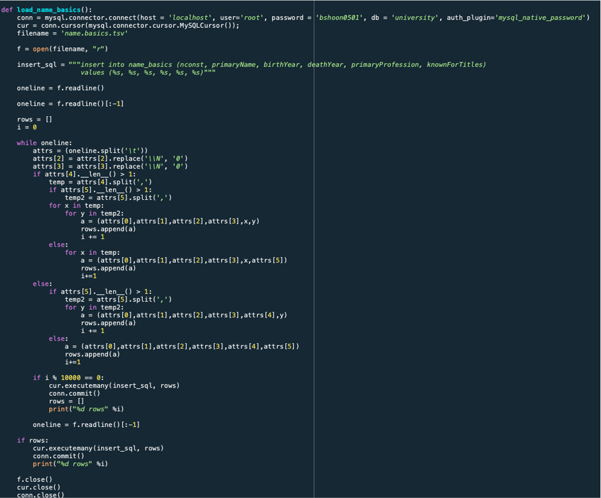
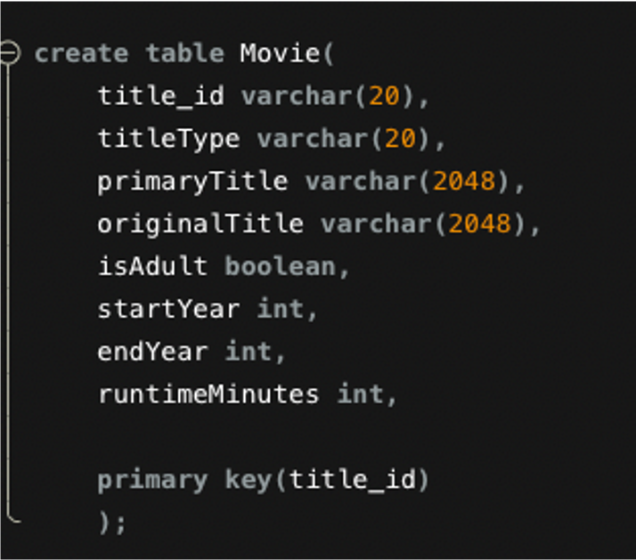
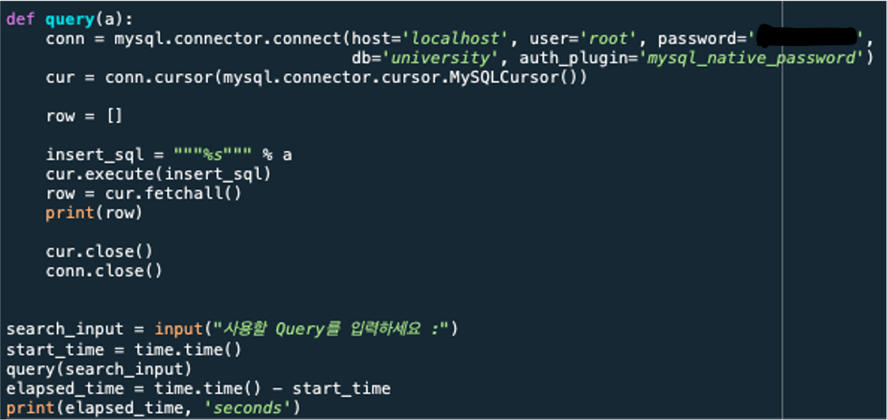

# IMDB
IMDB에서 주어진 데이터를 활용해 MySQL에 Relation DB 구축하고 이를 이용해 검색하는 Python 응용프로그램을 만든다.

[IMDB](https://www.imdb.com/interfaces/)에서 제공해주는 데이터에 대한 설명들

### name.basics.tsv.gz

Contains the following information for names:

  - nconst (string) - alphanumeric unique identifier of the name/person.
  - primaryName (string)– name by which the person is most often credited.
  - birthYear – in YYYY format.
  - deathYear – in YYYY format if applicable, else "\\N".
  - primaryProfession (array of strings) – the top-3 professions of the person.
  - knownForTitles (array of tconsts) – titles the person is known for.

### title.basics.tsv.gz

Contains the following information for titles:

  - tconst (string) - alphanumeric unique identifier of the title.
  - titleType (string) – the type/format of the title (e.g. movie, short,
    tvseries, tvepisode, video, etc).
  - primaryTitle (string) – the more popular title / the title used by the
  filmmakers on promotional materials at the point of release.
  - originalTitle (string) - original title, in the original language.
  - isAdult (boolean) - 0: non-adult title; 1: adult title.
  - startYear (YYYY) – represents the release year of a title. In the case of TV
  Series, it is the series start year.
  - endYear (YYYY) – TV Series end year. "\\N" for all other title types.
  - runtimeMinutes – primary runtime of the title, in minutes.
  - genres (string array) – includes up to three genres associated with the
  title.

### title.akas.tsv.gz

Contains the following information for titles:

  - titleId (string) - a tconst which is an alphanumeric unique identifier of
  the title.
  - ordering (integer) – a number to uniquely identify rows for a given titleId.
  - title (string) – the localised title.
  - region (string) - the region for this version of the title.
  - language (string) - the language of the title.
  - types (array) - Enumerated set of attributes for this alternative title. One
  or more of the following: "alternative", "dvd", "festival", "tv", "video",
  "working", "original", "imdbDisplay". New values may be added in the future
  without warning.
  **Please note that types is said to be an array. In the data we have this
  appears to not be true. There appears to be only one string for each pair of
  titleId and ordering values. Also, there are many NULL (\\N) values in this
  field (~95%).**

  - attributes (array) - Additional terms to describe this alternative title,
  not enumerated.
  **Please note that attributes is said to be an array. In the data we have this
  appears to not be true. There appears to be only one string for each pair of
  titleId and ordering values. There are many NULL (\\N) values in this field
  (~99%).**

  - isOriginalTitle (boolean) – 0: not original title; 1: original title.

### title.crew.tsv.gz

Contains the director and writer information for all the titles in IMDb. Fields
include:

  - tconst (string) - alphanumeric unique identifier of the title.
  - directors (array of nconsts) - director(s) of the given title.
  - writers (array of nconsts) – writer(s) of the given title.

### title.episode.tsv.gz

Contains the tv episode information. Fields include:

  - tconst (string) - alphanumeric identifier of episode.
  - parentTconst (string) - alphanumeric identifier of the parent TV Series.
  - seasonNumber (integer) – season number the episode belongs to.
  - episodeNumber (integer) – episode number of the tconst in the TV series.

### title.principals.tsv.gz

Contains the principal cast/crew for titles

  - tconst (string) - alphanumeric unique identifier of the title.
  - ordering (integer) – a number to uniquely identify rows for a given titleId.
  - nconst (string) - alphanumeric unique identifier of the name/person.
  - category (string) - the category of job that person was in.
  - job (string) - the specific job title if applicable, else "\\N".
  - characters (string) - the name of the character played if applicable, else
  "\\N" (It is really "[role1,role2,....]" or "\\N").

### title.ratings.tsv.gz

Contains the IMDb rating and votes information for titles

  - tconst (string) - alphanumeric unique identifier of the title.
  - averageRating – weighted average of all the individual user ratings.
  - numVotes - number of votes the title has received.

### IMDb dataset license details

Subsets of IMDb data are available for access to customers for personal and
non-commercial use. You can hold local copies of this data, and it is subject to
our terms and conditions. Please refer to the
[Non-Commercial Licensing](https://help.imdb.com/article/imdb/general-information/can-i-use-imdb-data-in-my-software/G5JTRESSHJBBHTGX?pf_rd_m=A2FGELUUNOQJNL&pf_rd_p=3aefe545-f8d3-4562-976a-e5eb47d1bb18&pf_rd_r=0J8FC9NDYKWB18MEW883&pf_rd_s=center-1&pf_rd_t=60601&pf_rd_i=interfaces&ref_=fea_mn_lk1#) and [copyright/license](https://www.imdb.com/conditions?pf_rd_m=A2FGELUUNOQJNL&pf_rd_p=3aefe545-f8d3-4562-976a-e5eb47d1bb18&pf_rd_r=0J8FC9NDYKWB18MEW883&pf_rd_s=center-1&pf_rd_t=60601&pf_rd_i=interfaces&ref_=fea_mn_lk2) and verify compliance.

## E/R Diagram

Strong Entity인 Movie, Person, Review와 Weak Entity인 Role,직업들 등 총 11개의 객체들 및 그들의 속성 그리고 각 객체간의 관계를 표현.

## Table Schema

 ER Diagram을 바탕으로 Relational DB를 표현하였다. 객체들의 Cardinality, 기본키, 외래키, 속성들을 표시

## 작성된 Table Schema를 토대로 Relation DB 설계 예시
### 1. 다운한 IMDB 파일을 읽어 MySQL에 데이터 삽입

### 2. 삽입된 데이터들을 이용해 직접 Table 생성, 데이터 삽입 및 Indexing

### 3. 적절한 Query를 이용하여 배우, 감독, 영화 등을 검색 -> 원하는 결과값 나오는지 확인
